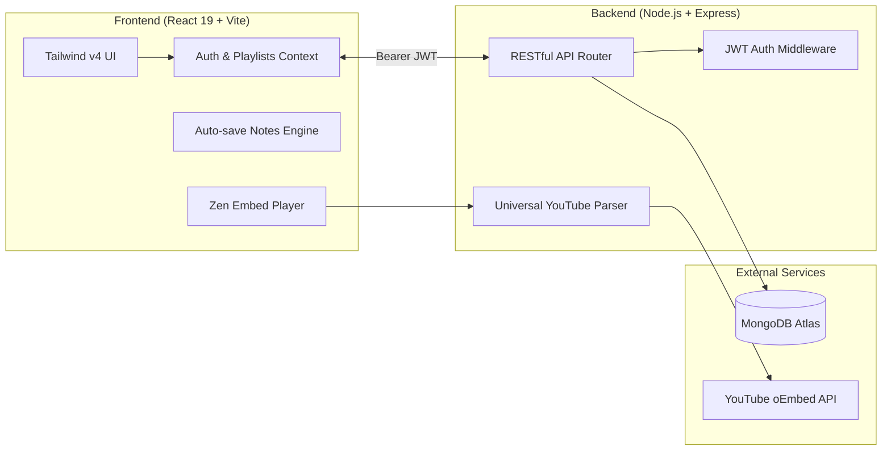

<div align="center">

# 🎥 FocusTube — Zen Study & Active Revision Hub

<p align="center">
  <strong>The distraction-free YouTube study sanctuary engineered for deep focus, timestamped notes, and active recall tracking.</strong>
</p>

<p align="center">
  <a href="#-key-features"></a>
  <a href="https://react.dev/"></a>
  <a href="https://tailwindcss.com/"></a>
  <a href="https://nodejs.org/"></a>
  <a href="https://www.mongodb.com/"></a>
  <a href="#-license"></a>
</p>

<br />

[Explore Features](#-key-features) • [Quickstart](#-quickstart--installation) • [Architecture](#-architecture--tech-stack) • [Deployment](#-deployment-guide) • [API Specs](#-api-reference)

---

</div>

## 💡 Why FocusTube?

Traditional YouTube is engineered for **watch-time retention, sensational thumbnails, and rabbit holes** — the exact opposite of what you need when studying complex algorithms, calculus proofs, or programming architectures.

| Standard YouTube ❌ | FocusTube Experience 🟢 |
| :--- | :--- |
| **Algorithmic Clickbait Sidebars** pulling you off track | **Zero Recommendations Frame**: Isolated player with no external suggestions |
| **Toxic / Distracting Comments** beneath every lecture | **Clean Study Pad**: Focused timestamped note-taking interface |
| **No Progress Retention**: You forget which parts you understood | **Active Recall Status**: Tag every video (*Need Revise*, *Slight*, *Done*) |
| **Disorganized Bookmarks**: Lost across browser tabs | **Curated Learning Tracks**: Playlists with % completion & reordering |
| **Manual Timers**: Context switching between apps | **Built-in Pomodoro Sprints**: 25m Focus / 5m Break with chime alerts |

---

## ⚡ Key Features

### 1. 🛡️ Isolated Zen Video Player
- **Universal Link Compatibility**: Accepts standard links (`watch?v=`), shortened links (`youtu.be/`), live streams & recorded webinars (`/live/`), YouTube Shorts (`/shorts/`), embeds, mobile share links, and raw 11-character video IDs.
- **Parametric Embed Isolation**: Locked with `rel=0&modestbranding=1&iv_load_policy=3&controls=1&showinfo=0&fs=1` to guarantee zero related external videos pop up.
- **Theater / Zen Mode**: Expands the video and notes to fill your entire display with a single click.

### 2. 🧠 Active Recall & Revision Command Center
- **Smart Retention Statuses**:
  - 🔴 **Need Revision** — Critical lectures requiring deep practice or re-watching.
  - 🟡 **Slight Revision** — Quick 5-minute memory refreshers before an exam.
  - 🟢 **Done / Mastered** — Fully understood (triggers celebratory confetti 🎉).
  - ⚪ **Unwatched** — Unstarted material.
- **Revision Command Center**: A dedicated hub listing all pending revision videos across all your playlists, filterable by urgency.

### 3. 📝 Interactive Timestamped Study Notes
- **Auto-Saving Scratchpad**: Real-time note-taking with debounced persistence and a live `Saved` indicator.
- **Clickable Timestamp Markers**: Type any timestamp (e.g. `04:15 - Dijkstra proof step`). Clicking the timestamp jumps the YouTube video directly to that second.
- **Export Anywhere**: One-click **Copy Notes** to clipboard or **Download as Markdown (`.md`)** for your Obsidian, Notion, or local archives.

### 4. 📂 Playlists & Learning Tracks
- Organize videos into structured curriculum tracks (e.g., *Stanford Algorithms*, *System Design*, *Calculus III*).
- Real-time progress bars calculating percentage of mastered videos.
- Move videos up/down to curate optimal lecture sequences.
- Automatic metadata extraction (title, channel, high-res thumbnail) via YouTube oEmbed without requiring expensive Google Cloud API keys.

### 5. ⏱️ Integrated Pomodoro Focus Sprint Timer
- Unobtrusive floating study timer built into the top navigation.
- Preset intervals: **25m Focus Sprint**, **5m Quick Break**, and **15m Rest**.
- Audio chime notification powered by the Web Audio API when intervals finish.

### 6. 📱 100% Mobile-First Responsive Design
- **Native-Style Bottom Bar**: Thumb-reachable navigation bar with safe-area insets for modern iOS and Android devices.
- **Adaptive 2x2 Touch Grid**: Revision pills adjust to a finger-friendly layout on smartphones.
- **Responsive Modals & Inputs**: Smooth virtual keyboard handling with adaptive viewports.

---

## 🏗️ Architecture & Tech Stack



### Stack Breakdown
- **Frontend**: React 19, Vite 8, Tailwind CSS v4, Lucide React, Canvas Confetti
- **Backend**: Node.js 22, Express 4, Mongoose 8, JWT (JSON Web Tokens), Bcrypt.js
- **Database**: MongoDB Atlas (Cloud)
- **Metadata**: YouTube oEmbed integration (Free, zero API quota limitations)

---

## 🚀 Quickstart & Installation

### Prerequisites
- [Node.js](https://nodejs.org/) (v18 or higher — v22 recommended)
- [Git](https://git-scm.com/)
- A free [MongoDB Atlas](https://www.mongodb.com/atlas/database) connection string (or local MongoDB)

### Option A: 1-Click Launch (Windows)
Double-click `start.bat` in the project root. It will concurrently boot both backend and frontend servers in separate terminal windows!

---

### Option B: Manual Setup

#### 1. Clone the repository:
```bash
git clone https://github.com/sirshendu07/focus-tube.git
cd focus-tube
```

#### 2. Configure Backend:
```bash
cd backend
npm install
```

Create a `.env` file in `backend/`:
```env
PORT=5002
MONGO_URI=your_mongodb_atlas_connection_string
JWT_SECRET=your_super_secret_jwt_key
```

Start the backend:
```bash
npm start
```
*Backend runs on `http://localhost:5002`.*

#### 3. Configure Frontend:
Open a second terminal:
```bash
cd ../frontend
npm install
npm run dev
```
*Frontend runs on `http://localhost:5174`.*

Open **`http://localhost:5174`** in your browser to start studying distraction-free!

---

## 🌐 Deployment Guide

### 1. Deploy Backend (Render / Railway)
1. Go to [Render Dashboard](https://dashboard.render.com/) ➔ **New +** ➔ **Web Service**.
2. Select repository: `https://github.com/sirshendu07/focus-tube`.
3. Set configuration:
   - **Root Directory**: `backend` *(Important!)*
   - **Build Command**: `npm install`
   - **Start Command**: `npm start`
4. Add Environment Variables:
   - `MONGO_URI`: `your_mongodb_atlas_uri`
   - `JWT_SECRET`: `your_jwt_secret`
   - `NODE_ENV`: `production`
5. Copy your live backend URL (e.g., `https://focustube-backend.onrender.com`).

### 2. Deploy Frontend (Vercel)
1. Go to [Vercel Dashboard](https://vercel.com/new) ➔ Import `sirshendu07/focus-tube`.
2. Configure project:
   - **Root Directory**: `frontend` *(Important!)*
   - **Framework Preset**: `Vite`
   - **Build Command**: `npm run build`
   - **Output Directory**: `dist`
3. Add Environment Variable:
   - `VITE_API_URL`: `https://focustube-backend.onrender.com` *(Your Render URL)*
4. Click **Deploy**. Your site will be live worldwide in ~30 seconds!

---

## 📡 API Reference

### Authentication (`/api/auth`)
| Method | Endpoint | Description | Auth Required |
| :--- | :--- | :--- | :--- |
| `POST` | `/api/auth/register` | Register new user account | No |
| `POST` | `/api/auth/login` | Log in and receive JWT token | No |
| `GET` | `/api/auth/me` | Fetch profile & real-time study stats | Yes |

### Playlists (`/api/playlists`)
| Method | Endpoint | Description | Auth Required |
| :--- | :--- | :--- | :--- |
| `GET` | `/api/playlists` | List all user playlists with stats | Yes |
| `POST` | `/api/playlists` | Create a new study playlist | Yes |
| `GET` | `/api/playlists/:id` | Get playlist details with video sequence | Yes |
| `PUT` | `/api/playlists/:id` | Update playlist metadata | Yes |
| `DELETE` | `/api/playlists/:id` | Delete playlist and associated videos | Yes |

### Videos & Revision (`/api/videos`)
| Method | Endpoint | Description | Auth Required |
| :--- | :--- | :--- | :--- |
| `GET` | `/api/videos/preview?url=` | Instant metadata extraction & validation | **No** (Public) |
| `GET` | `/api/videos` | Query videos (filters: `status`, `playlistId`, `search`) | Yes |
| `POST` | `/api/videos` | Save YouTube video into collection | Yes |
| `PATCH` | `/api/videos/:id/revision`| Update status (`need_revise`, `slight_revision`, `done`) | Yes |
| `PATCH` | `/api/videos/:id/notes` | Save study notes & timestamp bookmarks | Yes |
| `POST` | `/api/videos/reorder` | Bulk update video sequence in playlist | Yes |
| `DELETE` | `/api/videos/:id` | Remove video from account | Yes |

---

## ⌨️ Pro Study Shortcuts

| Shortcut | Action |
| :--- | :--- |
| `Space` / `K` | Toggle Play / Pause |
| `F` | Toggle Fullscreen |
| `J` / `L` | Seek 10s backward / forward |
| `0` - `9` | Jump to 0% – 90% of the video duration |
| `M` | Mute / Unmute audio |

---

## 🛡️ License

Distributed under the **MIT License**. Feel free to use, customize, and build upon FocusTube for your own study workflows.

<div align="center">
  <sub>Built with ❤️ for focused learners and deep-work scholars everywhere.</sub>
</div>
